# Lab02: Local Features
This lab contains 2 tasks:
1. Harris corner detection
2. Descrption & matching

Since it's the first tutorial, we create a new conda environment for it and install necessary packages.
```bash
conda create --name CV python=3.8
conda install numpy
conda install scipy
pip install opencv-python
```

## Implementation
### Harris Corner Detection
#### **Gradients**
We use the following $x$ gradient mask

$$G_x = \begin{pmatrix} 0 & -0.5 & 0 \\ 0 & 0 & 0   \\ 0 & 0.5 & 0 \end{pmatrix}$$

and the $y$ gradient mask is simply the transpose of $G_x$. Convolve these two masks with the image we have gradient intensity $I_x$ and $I_y$.

#### **Local Auto-correlation Matrix**
Because there's a $2\times 2$ matrix defined at each pixel, we flatten it into a $h\times w\times 4$ matrix. Applying element wise operations we have

$$\begin{align*} I_x^2 = I_x * I_x \\ I_y^2 = I_y * I_y \\ I_{xy} = I_x * I_y\end{align*}$$

And then blur them seperately.

#### **Harris response function**
By defintion
$$R = \det (M) - k \mathrm{Tr}^2(M) = R_{11}R_{22} - R_{12}R_{21} - k (R_{11}+R_{22})^2$$
Simply apply elementwise operations on the matrices we have obtained.

#### Detection with Threshold
It's easy to get pixels with response value above the threshold. For non-maximum suppression, we apply the maximum filter. Compare the filtered image with the orginal one, pixels that are maximal in the center should not differ.

### Descrption & matching
#### **Sum of squared differences**
To vectorize the opeations, we notice that for one pixel
$$ssd =  (\mathbf{p}-\mathbf{q})^\top (\mathbf{p}-\mathbf{q}) = \mathbf{p}^2 - 2\mathbf{p}^\top\mathbf{q} + \mathbf{q}^2$$

To obtain $\mathbf{p}^\top\mathbf{q}$, we simply calculate $desc1 * desc2^\top$ which is exactly a $q_1 \times q_2$ matrix. 

$\mathbf{p}^2$ corresponds to a matrix 
$$\begin{pmatrix} \mathbf{p}_1^2 & \mathbf{p}_1^2  &\cdots & \mathbf{p}_1^2 \\ \mathbf{p}_2^2 & \mathbf{p}_2^2  &\cdots & \mathbf{p}_2^2 \\ \cdots & \cdots & \cdots & \cdots \\ \mathbf{p}_n^2 & \mathbf{p}_n^2 & \cdots & \mathbf{p}_n^2 \end{pmatrix}$$

$\mathbf{q}^2$ corresponds to a matrix
$$\begin{pmatrix} \mathbf{q}_1^2 & \mathbf{q}_2^2  &\cdots & \mathbf{q}_n^2 \\ \mathbf{q}_1^2 & \mathbf{q}_2^2  &\cdots & \mathbf{q}_n^2 \\ \vdots & \vdots & \vdots & \vdots \\ \mathbf{q}_1^2 & \mathbf{q}_2^2  &\cdots & \mathbf{q}_n^2 \end{pmatrix}$$

#### Matching
- One way: simply find the minimal value along y-axis
- Mutual: apply two times one way and find the common elements
- Ratio: find the minimal two values along y-axis and compare the ratio with the threshold


## Results
### Harriss Corner Detection
The threshold $10^{-5}$ is used for blocks and house. $5 * 10^{-5}$ is used for I1 and I2.
|        | direct                        | filter edge                     |
| ------ | ----------------------------- | ------------------------------- |
| blocks | 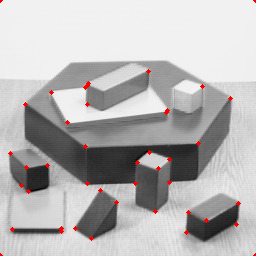 | 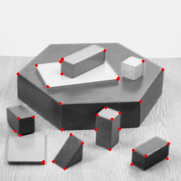 |
| house  | 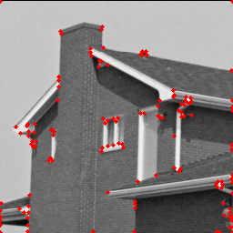  | 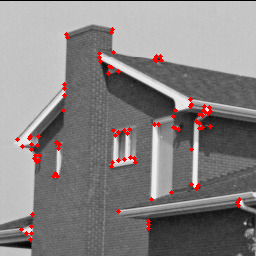  |
| l1     | 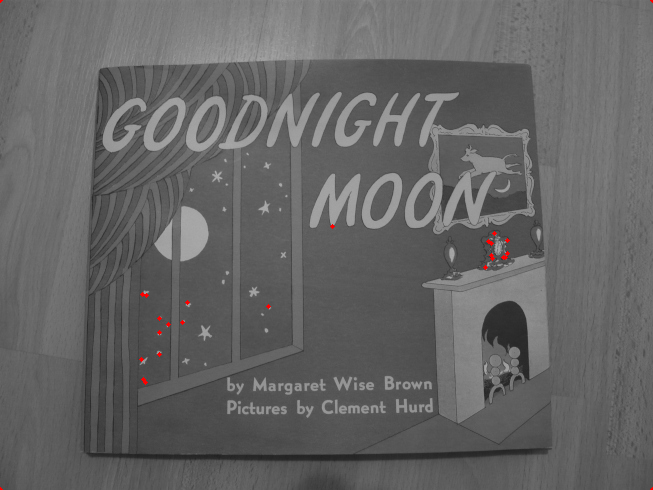     |      |
| l2     | 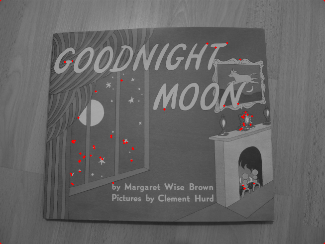     |      |

### Matching
To make the results more clear, a threshold of $5 * 10 ^{-5}$ is used
|         | images                       | Remark                                                      |
| ------- | ---------------------------- | ----------------------------------------------------------- |
| one way | 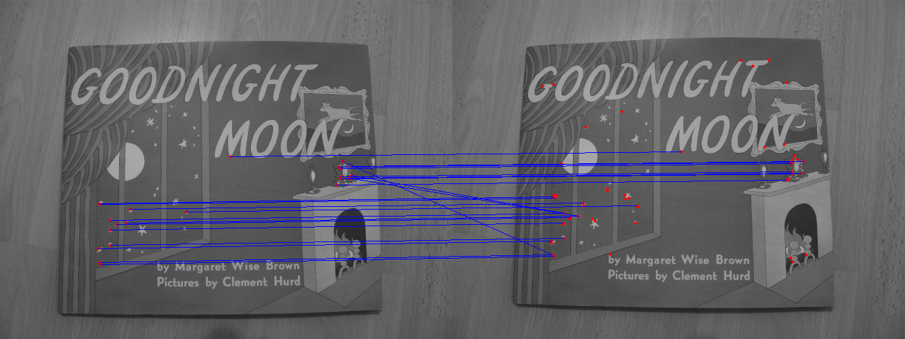     | (23 points)                                                 |
| mutual  | 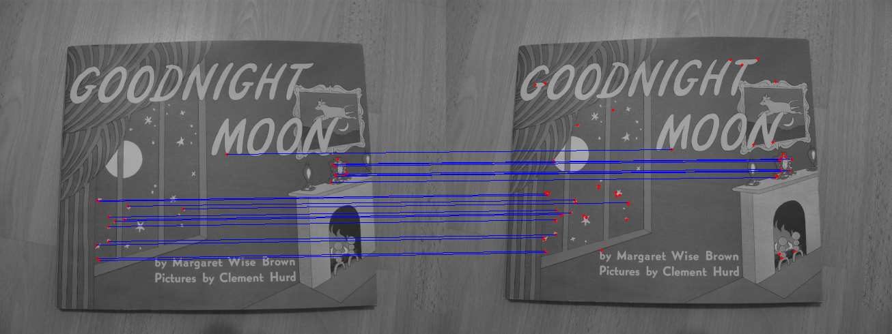 | Wrongly matched pixels are discarded    (20 points)         |
| ratio   | 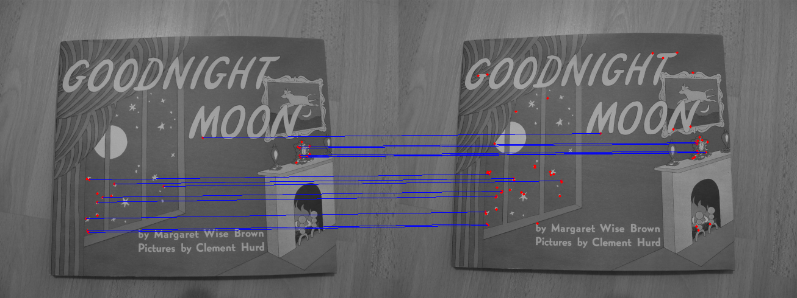  | Some correctly matched pixels are even discarded(14 points) |

### Other results
|       | x gradient          | y gradient          |
| ----- | ------------------- | ------------------- |
| house | 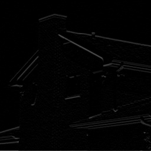 | 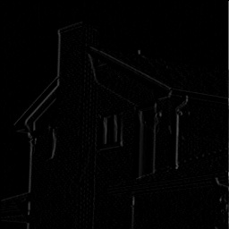 |
