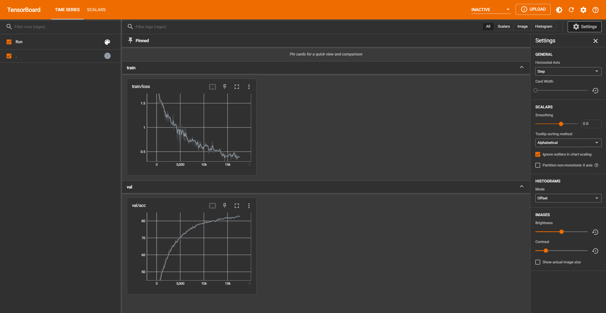

# Computer Vision Exercise 4 Report
*Name*: Jingyu Wang
*Legi*: 21-956-453

## BOW Classifier

### Feature Extraction

#### Feature Detection
`grid_points(img,nPointsX,nPointsY,border)`: 
Gird is not on pixel. (i,j) grid point is the bottom-right corner of (i,j) cell. Use `np.linspace()` and `np.meshgrid()` to creat the grid

#### Feature Description
`descriptors_hog(img,vPoints,cellWidth,cellHeight)`:
HOG created following the method in https://courses.cs.duke.edu/compsci527/fall15/notes/hog.pdf. We assign weights(magnitudes) to different bins in a linear interpolation way. 

### Codebook Construction
`create_codebook(nameDir,k,numiter)`:
Simply combine `grid_points(img,nPointsX,nPointsY,border)` and `descriptors_hog(img,vPoints,cellWidth,cellHeight)` to get features for each image.

### Bag-of-words Vector Encoding
#### Bag-of-Words Histogram
`bow_histogram(vFeatures, vCenters)`:
Use `np.unique()` to get counts of each visual word.

#### Processing a Directory with Training Examples
`create_bow_histograms(nameDir,vCenters)`:
Easy to implement. Simply combine functions above.

### Nearest Neighbor Classification
`bow_recognition_nearest(histogram,vBoWPos,vBoWNeg)`:
Use already implemented `findnn()` to get the nearest distance in each category.

## CNN Classifier

Simplified vgg is easy to implement. One remark is that I've used a `nn.Flatten()` layer in the `classifier` block otherwise the dimension will not match.

**Tensorboard results**
