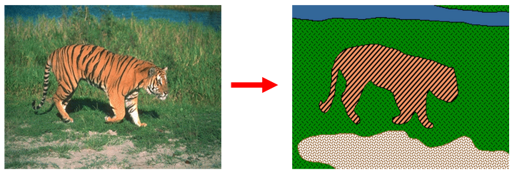
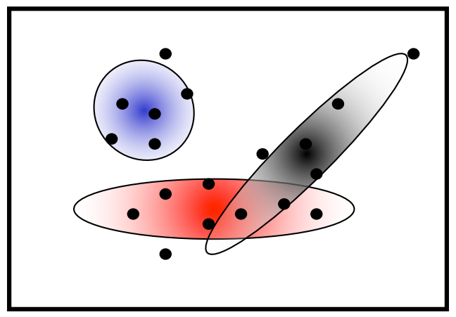
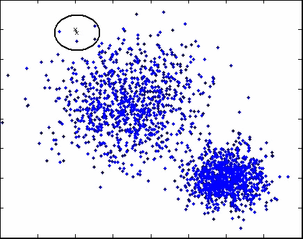
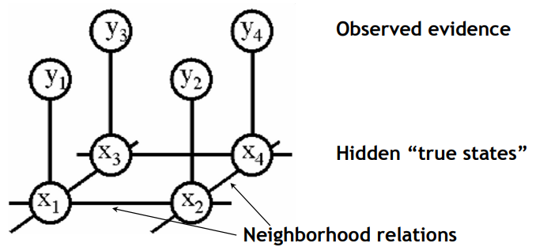
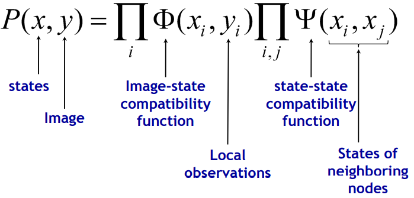

---
tags:
- CV
date: 02/11/2022
---

# Image Segmentation
## Segmentation as Grouping
**Goals**:
- Delineate objects and background regions
- Group similar-looking pixels for efficiency of further processing

### K-Means Clustering
Best cluster centers are those that minimize SSD between all points and their nearest cluster center $c_{i}$ :

$$
\sum_{c_{i}} \sum_{p\in C_{i}} \|p-c_{i}\|^{2}
$$

where $c_{i}$ is the center of cluster $C_{i}$ and $p$ is the corresponding feature point of a pixel.

Note that $p$ is point in the feature space which can be:
- Intensity
- RGB value
- Texture
- Intensity + position
- RGB + $(x,y)$
Clustering based on $(r,g,b,x,y)$ or $(I,x,y)$ values enforces more spatial coherence

> **K-Means Clustering**
> 1. Randomly initialize the cluster centers, $c_{1},\dots c_{k}$
> 2. Given cluster centers, determine points in each cluster: For each point $p$, find the closest $c_{i}$ . Put $p$ into cluster
> 3. Given points in each cluster, solve for $c_{i}$. Set $c_{i}$ to be the mean of points in cluster $i$.
> 4. If $c_{i}$ have changed, repeat Step 2

K-Means will ==always converge== to some solution but it can be a "local minimum", and it ==does not always find the global minimum.==

| **Pros:**                                                                                   | **Cons:** |
| ------------------------------------------------------------------------------------------- | --------- |
| - Simple, fast to compute   - Converges to local minimum of within-cluster squared error | - Problem setting $K$   - Sensitive to initial centers   - Sensitive to outliers   - Detects spherical clusters only   - Assuming means can be computed          |

### Mixtures of Gaussian

*MoG* is a generative model:
- Assume there are $K$ Gaussian blobs with means $\boldsymbol{\mu}_{b}$ and covariance matrices $V_{b}$ in dimension $d$

$$
P(\mathbf{x}|\mu_{b}, V_{b}) = \frac{1}{\sqrt{ (2\pi)^{d}|V_{b}| }} e^{ -\frac{1}{2} (\mathbf{x}-\boldsymbol{\mu}_{b})V_{b}^{-1}(\mathbf{x}-\boldsymbol{\mu}_{b})}
$$

- Blob $b$ is selected with probability $\alpha_{b}$
- The likelihood of observing $\mathbf{x}$ is a weighted mixture of Gaussians:

$$
P(\mathbf{x}|\theta) = \sum_{b=1}^{K} \alpha_{b} P(\mathbf{x}|\theta_{b}), \quad \theta = \{\mu_{1},\dots,\mu_{K}, V_{1},\dots,V_{K}\}
$$

>**Expectation Maximization**: see [EM algorithm](EM%20algorithm%20.pdf) for formal proof
>E-step:
>- Compute probability that point $x$ is in blob $b$, given the current guess of $\theta$
>
>$$P(b|x,\mu_{b},V_{b})=\frac{\alpha_{b}P(x|\mu_{b}, V_{b})}{\sum_{j=1}^{K}\alpha_{j}P(x|\mu_{j},V_{j})}$$
>
>M-step:
>- Compute the overall probability that blob $b$ is selected ($N$ data points)
> 
> $$\alpha_{b}^{\text{new}} = \frac{1}{N} \sum_{i=1}^{N} P(b| x_{i}, \mu_{b}, V_{b}) = \frac{1}{N}\sum_{i=1}^{N} \frac{\alpha_{b}P(x|\mu_{b}, V_{b})}{\sum_{j=1}^{K}\alpha_{j}P(x|\mu_{j},V_{j})}$$
> 
>- Mean of blob $b$
> 
> $$\mu_{b}^{\text{new}} = \frac{ \sum_{i=1}^{N}x_{i}P(b|x_{i},\mu_{b},V_{b})}{\sum_{i=1}^{N}P(b|x_{i},\mu_{b}, V_{b})}$$
> 
> - Covariance of blob $b$
> 
> $$V_{b}^{\text{new}} = \frac{\sum_{i=1}^{N}(x_{i}-\mu_{b}^{\text{new}})(x_{i}-\mu_{b}^{\text{new}})^{\top} P(b|x_{i},\mu_{b},V_{b})}{\sum_{i=1}^{N}P(b|x_{i},\mu_{b},V_{b})}$$

| **Pros:** | **Cons:** |
| --------- | --------- |
| - Probabilistic interpretation  - Soft assignments between data points and clusters  - Generative model, can predict novel data points - Relatively compact storage $O(Kd^{2})$          | - Initialization(Often a good idea to start from output of $k$-means)  - Local minima   - Need to choose blob generative model  - Numerical problems are often a nuisance         |

### Model-Free Clustering: Mean-Shift

>**Iterative Mode Search**:
>1. Initialize seed center $c$ and window $W$
>2. Calculate center of gravity (the “mean”) of $W$: $\sum_{x\in W} xH(d(x,c))$, where $H(\cdot)$ is a kernel function.
>3. Shift the search window to the mean
>4. Repeat steps 2+3 until convergence 

>**Mean-Shift Algorithm**:
>1. Choose features (color, gradients, texture, etc)
>2. Initialize windows at individual pixel locations
>3. Start iterative mode search from each window until convergence
>4. Merge windows that end up near the same “peak” or mode

The output cluster is all data points in the attraction basin of a mode, and the attraction basin is defined to be the region for which all trajectories lead to the same mode.

| **Pros:**                                                                                                                                                                                                                                                                 | **Cons:** |
| ------------------------------------------------------------------------------------------------------------------------------------------------------------------------------------------------------------------------------------------------------------------------- | --------- |
| - General, application-independent tool  - Model-free, does not assume any prior shape(spherical, elliptical, etc.) on data clusters  - Just a single parameter(window size $h$)   - Finds variable number of modes given the same $h$   - Robust to outliers | - Output depends on window size $h$  - Window size (bandwidth) selection is not trivial  - Computationally rather expensive  - Does not scale well with dimension of feature space          |

## Hough Transforms(Edge Based)
Suppose we would like to detect straight lines. These are important given their omnipresence in man-made scenes. The analysis is as if the lines are of infinite length, but we will be able to extract line segments with the Hough approach. 

A straight line could be described as 

$$
y = ax + b
$$

And for a fixed point $(x,y)$, all lines passing through the point is:

$$
b = -xa + y
$$

and forms a line in the parameter space

**Basic idea:**  
1. convert the image into binary image and we are interested in white points, thus $(x,y)$
2. discretize the parameter space
3. a counter is set at each node and is incremented whenever a line passes through it
4. after drawing all the lines, peaks are detected

However, in cartesian coordinates, $a$ is unbounded and thus requires infinite grids. To avoid this, we turn to polar coordinates, in which a line in the image space is described as 

$$
x\cos\theta + y \sin\theta = \rho
$$

and $(\theta,\rho)$ is bounded. 

| Example        |                                    |
| -------------- | ---------------------------------- |
| Simple shapes   |  |
| Complex scenes |  | 

**Remarks**
1. time consuming 
2. robust to outliers and lots of points not on a line 
3. peak detection is difficult with noise in edge coordinates 
4. Robustness of peak detection increased by weighting contributions (votes that are proportional with intensity gradient magnitude) 
5. can do it also for circles and even higher-order parametric shapes (but it quickly gets harder as number of shape parameters grows

## Interactive Segmentation with GraphCuts
### Markov Random Fields
Please refer to [Introduction to Markov Random Fields](https://cgi.luddy.indiana.edu/~natarasr/Courses/I590/Papers/MRF.pdf)

The observed evidence is the pixel value(intensity or RGB), the hidden true state is the category the pixel belongs to. The joint probability of the observed evidence and the hidden true states is described by the function below:

Maximizing the joint probability is the same as maximizing the log likelihood below:

$$
E(x,y) = \sum_{i}\phi(x_{i}, y_{i}) + \sum_{i,j} \psi(x_{i}, x_{j})
$$

This is similar to free-energy problems in statistical mechanics (spin glass theory). We therefore draw the analogy and call E an energy function. $\phi$ and $\psi$ are called potentials (unary an pairwise).
- Unary potentials $\phi$
	- Encode local information about the given pixel/patch.
	- How likely is a pixel/patch to be in a certain state?
- Pairwise potentials $\psi$
	- Encode neighborhood information.
	- How different is a pixel/patch's label from that of its neighbor?

### Graph Cuts
[Graph Cuts in Vision and Graphics: Theories and Applications](https://cs.uwaterloo.ca/~yboykov/Papers/chapter_04.pdf)

#### GraphCut Application: "Grabcut"

>Interactive Image Segmentation [Boykov & Jolly, ICCV’01]
> - Rough region cues sufficient
> - Segmentation boundary can be extracted from edges
> Procedure:
> - User marks foreground and background regions with a brush get initial segmentation
> - Correct by additional brush strokes
> - Alternatively, user can specify a bounding box

## Learning-based Approach

### Traditional Machine Learning

#### KNN

Find the $K$ nearest neighbors within the training dataset for a sample (in feature space). For training examples we know the features and the labels.

==KNN is a deterministic and lazy-learning model.== We first define the distance of training examples in feature space and when test example comes in, it's labeled by the majority label its $K$-nearest neighbors have, i.e.

$$
f(\vec{v}) = f(c_{1},\dots,c_{K}) = \max(\sharp \text{label})
$$

where $\vec{v}$ is the incoming example and $c_{i}$ is the label its $i$-th nearest neighbor has. 

**Pros**:  
- Very simple to implement 
- Very simple to understand 
- Efficient implementations possible for approx. NNs 
- Distance definition is flexible

**Cons**:
- Highly depends on the definitions of distance and $K$
- Need to keep the entire data in memory for distance computations 
- For high dimensional problems (with high d) might need many training samples for accuracy 
- Other methods have better generalization ability

#### Radnom Forests

Random forests are a collection of binary decision trees. 

Two key concepts that give it the name random:
1.  A random sampling of training data set when building trees.
2.  Random subsets of features considered when splitting nodes.

Different trees are trained independently and the output of the model when testing is the majority vote of all trees.

**Pros**
- Easy to implement 
- Very efficient during testing 
- Can easily use diverse features 
- Can handle high dimensional spaces

**Cons**:
- Lots of parametric choices 
- Needs large number of data 
- Training can take time

### Deep Learning Methods

