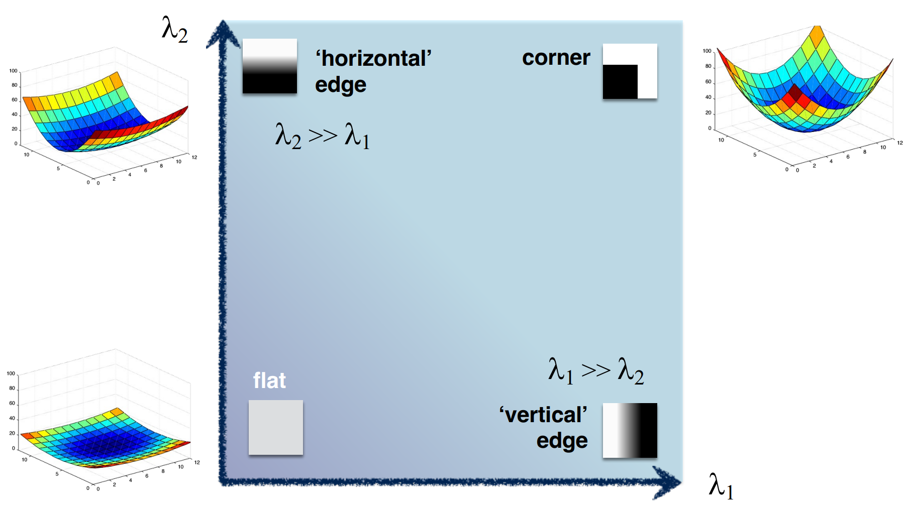
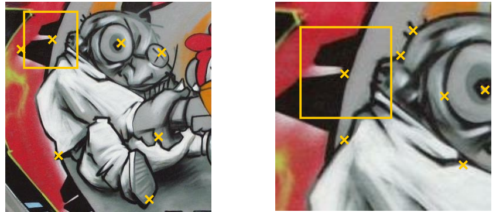
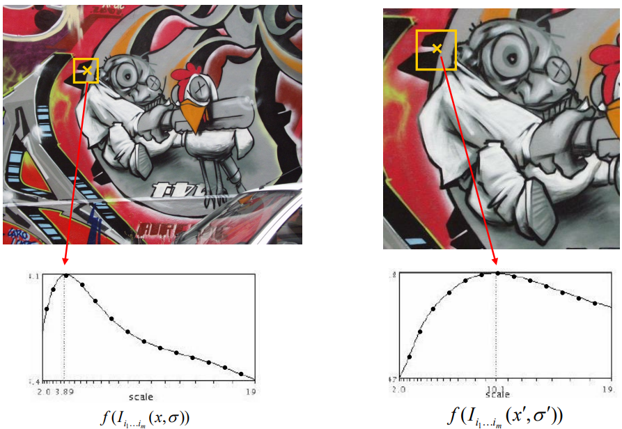
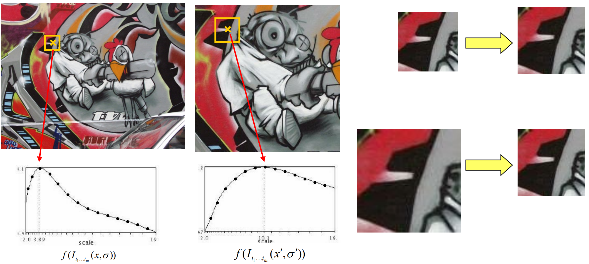
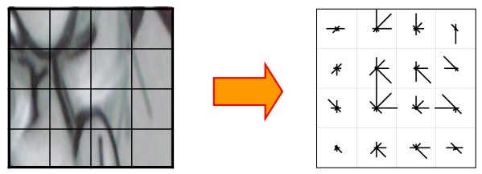

---
tags:
- CV
date: 28/09/2022
---

# Local Features
## Motivation
**Local Image Descriptors**: it's the ID of an image thus an important tool for matching "things" in different images.

By matching things we can:
- 3D reconstruction
- track objects
- AR
- detect objects
- mosaic images into panoramas

**Requirements for a descriptor**:
- Region extraction needs to be repeatable and accurate
	- Invariant to translation, rotation, scale changes
	- Robust to out-of-plane($\sim$ affine) transformations
	- Robust tot lighting variations, noise, blur, quantization
- Locality: Features are local, therefore robust to occlusion and clutter
- Quantity: We need a sufficient number of regions to cover the object
- Distinctiveness: The regions should contain “interesting” structure
- Efficiency: Close to real-time performance

**General Approach of Image Matching**:
1. Find a set of distinctive keypoints
2. Define a region around each keypoint
3. Extract and normalize the region content
4. Compute a local descriptor from the normalized region
5. Match local descriptors

## Keypoint Localization
Goals:
- Repeatable detection
- Precise localization
- Interesting content

### Well localizable patch
Shifting the patch a bit should make a big difference in terms of the underlying pattern.

Three cases are showed below
| Flat                           | Edge                               | Corner                               |
| ------------------------------ | ---------------------------------- | ------------------------------------ |
|  |      |        |
| no change in all directions    | no change along the edge direction | significant change in all directions | 

By the comparison above we know that corner detection could effectively be keypoint detection. 

Consider shifting the patch or 'window' by $(u,v)$, define the sum of squared differences(SSD):

$$
E(u,v) = \sum_{(x,y)\in W} [I(x+u, y+v) - I(x,y)]^{2}
$$

Take the Taylor's expansion up to the first order:

$$
I(x+u, y+v) \simeq I(x,y) + \frac{ \partial I }{ \partial x } u + \frac{ \partial I }{ \partial y } v = I(x,y) + \begin{bmatrix}
I_{x} & I_{y}
\end{bmatrix}
\begin{bmatrix}
u \\
v
\end{bmatrix}
$$

Thus we rewrite SSD as

$$
E(u,v) = \sum_{(x,y)\in W} \begin{bmatrix}
u & v
\end{bmatrix}
\begin{bmatrix}
I_{x}^{2} & I_{x}I_{y} \\
I_{y}I_{x} & I_{y}^{2}
\end{bmatrix}
\begin{bmatrix}
u \\
v
\end{bmatrix}= 
\begin{bmatrix}
u & v
\end{bmatrix}
M
\begin{bmatrix}
u \\
v
\end{bmatrix}
$$

where 

$$
M = \sum\begin{bmatrix}
I_{x}^{2} & I_{x}I_{y} \\
I_{y}I_{x} & I_{y}^{2}
\end{bmatrix}
$$

The surface $E(u,v)$ is locally approximated by a quadratic form:

### Harris Detector Formulation

$$
\large
E(u,v) = \sum_{x,y} \underbrace{ w(x,y) }_{ \text{window function} } [I(x+u, y+v) - I(x,y)]^{2} = \begin{bmatrix}
u & v
\end{bmatrix}
M
\begin{bmatrix}
u \\
v
\end{bmatrix}
$$

where 

$$
M = \sum_{x,y} w(x,y)\begin{bmatrix}
I_{x}^{2} & I_{x}I_{y} \\
I_{y}I_{x} & I_{y}^{2}
\end{bmatrix}
$$

and the window function could either be delta or Gaussian

We wish $E(u,v)$ varies quickly along $u$ **and** along $v$, which makes it a corner. To meet this criteria, $M$ must have two large eigen values in almost the same scale.

To measure this property, ==we need a function that has large value when both eigen values are large==:
1. Kanade & Tomasi (1994) $R = \min(\lambda_{1},\lambda_{2})$
2. Harris & Stephens (1988) $R = \lambda_{1}\lambda_{2} - k(\lambda_{1}+\lambda_{2})^{2}$
3. Nobel (1998) $R = \frac{\lambda_{1}\lambda_{2}}{\lambda_{1} + \lambda_{2} + \epsilon}$

| Kanade & Tomasi | Harris & Stephens              | Nobel |
| --------------- | ------------------------------ | ----- |
|                 |  |       |

Choices of window function $w(x,y)$:
- uniform window
	- Sum over square window 
	- Problem: not rotation invariant
- Gaussian
	- Calculated by convolution
	- Result is rotation invariant

## Scale Invariant Region Selection
Harris detector is rotation invariant. However, it's not scale invariant. 

The Harris operators return us the interest points $(x,y)$ where corners are located. However, ==in order to define the feature descriptions (feature vector representations) for the interest points, and to compare the points between images, we need more than just a point of interest, but a region around it.==

Once we have a region, we could use various descriptors, e.g. [HoG](Histogram%20of%20Oriented%20Gradients.md).

### Automatic Scale Selection

We could surely do exhaustive search to choose the patch size in different images, but doing so is fairly inefficient.

Another approach to the optimal scale selection is to design a _signature function_ on the region (image patch around the interest point) that is scale-invariant. More specifically, a designed function takes a region around the point and outputs its response as a scalar given the region. Keep in mind that the varying input of this signature function is not the point $(x,y)$, but the size of the region around the point $(x,y)$. Therefore, we can ==consider the signature function as a function of region size (or image patch width) for a point in one image.==

- Choose a signature function (scale invariant)

- Sample different scale around the interesting points(detected by Harris Detector etc.) and find the local optimum as the characteristic scale.

- Calculate the local descriptor in both images

#### Signature Function
- Laplacian-of-Gaussian = "blob" detector

$$
\text{LoG} = - \frac{1}{\pi\sigma^{4}}\left[ 1 - \frac{x^{2}+y^{2}}{2\sigma^{2}}e^{ - (x^{2}+y^{2})/2\sigma^{2} } \right]
$$

Due to the characteristic of _LoG_, it detects ‘**blobs**’ in the input image and returns the highest response around them. To understand why this is the case, think of the nature of filters. Filters have a shape of what they are designed to detect, and they output the maximum response when the input has the same looking as the filters. Around the center of _LoG_ filter, we can find a blob, and this is why _LoG_ is a blob detector.

**In short, now we are looking for blobs in the image as a local feature and their corresponding suitable scales by applying LoG filters with varying scales 𝝈**

- Difference-of-Gaussian

The noticeable observation here is that Subtracting one Gaussian by another approximates the Laplacian of Gaussian. This indicates while approximating the LoG, there is no actual derivative computation needed. One additional reason why DoG is beneficial is that it is common in computer vision tasks that an image is filtered by Gaussian filters at many scales. While storing the Gaussian-filtering results of an image, we can easily make use of them to extract edges by computing the difference between subsequent filtering outputs, without actual computation of image derivatives.

## Local Descriptors
Many different descriptors could be used in matching, such as color histogram, spatial histogram or orientation histogram, etc.

### Feature Descriptors: SIFT(Scale Invariant Feature Transform)
1. Divide patch into $4\times 4$ sub-patches: 16 cells
2. Compute histogram of gradient orientations (8 reference angles) for all pixels inside each sub-patch
3. Resulting descriptor: $4\times 4 \times 8 = 128$ dimensions

### Rotation Invariant Descriptors
1. Find local orientation
	- Dominant direction of gradient for the image patch 
2. Rotate patch according to this angle
	- This puts the patches into a canonical orientation 

## Reference
[[CV] 11. Scale-Invariant Local Feature Extraction(1): Auto Scale Selection | by jun94 | jun-devpBlog | Medium](https://medium.com/jun94-devpblog/cv-11-scale-invariant-local-feature-extraction-1-auto-scale-selection-265049027bf1)
[[CV] 3. Gradient and Laplacian Filter, Difference of Gaussians (DOG) | by jun94 | jun-devpBlog | Medium](https://medium.com/jun94-devpblog/cv-3-gradient-and-laplacian-filter-difference-of-gaussians-dog-7c22e4a9d6cc)
