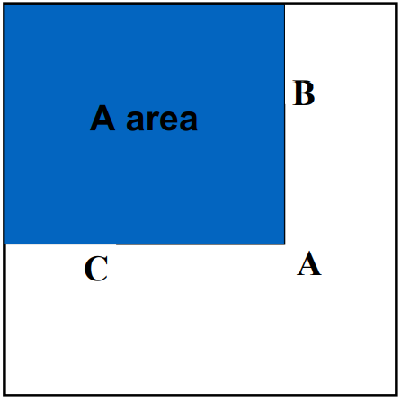

---
tags:
- CV
date: 09/11/2022
---

# Object Detection

## Sliding Window Detection
The simplest idea to do detection is combining sliding window and binary classifier:
1. Slide a window through the whole image thus we get a bunch of image patches(size depending on the window size).
2. Use many binary classifiers to determine weather an specified object (in the database of the classifier) appears or not.
3. Potentially calculate a bounding box around the object.

[Sliding Windows for Object Detection with Python and OpenCV - PyImageSearch](https://pyimagesearch.com/2015/03/23/sliding-windows-for-object-detection-with-python-and-opencv/)

Note that the window size is predefined by the user. We could use multiple window sizes on a single image to increase the accuracy.

## Viola-Jones Face Detector

Here is a report gives a concrete implementation of V.J. face detector: [Study of Viola-Jones Real Time Face Detector](https://web.stanford.edu/class/cs231a/prev_projects_2016/cs231a_final_report.pdf).

> 3 key components of the Viola-Jones detection algorithm: 
> - the introduction of a new image representation called ”Integral Image” which allows the features used by our detector to be computed very quickly; 
> - a learning algorithm, based on AdaBoost, which selects a small number of critical visual features from a larger set and yields extremely efficient classifiers; 
> - a method for combining increasingly more complex classifiers in a ”cascade” which allows background regions of the image to be quickly discarded while spending more computation on promising face-like regions.

### Image Integral and Feature Extraction

#### Integral image
The integral image computes a value at each pixel $(x,y)$ that is the sum of all pixel values above and to the left of $(x,y)$, inclusive. This can quickly be computed in one pass through the image.

$$
I_{\Sigma}(x,y) = \sum_{x'<x, y'<y} I(x',y')
$$

Compute sum within a rectangle

|  |  |  |  |  |
| ------------------ | ------------------ | ------------------- | ------------------- | ------------------- |
| $R = A - B - C +D$ | $A$                | $B$                 | $C$                 | $D$                 | 

Only 3 additions are required for any size of rectangle.

#### Rectangle filters
$$
\text{value} = \sum(\text{pixels in white area}) - \sum(\text{pixels in black area})
$$

### AdaBoost Learning

> **Original Adaboost algorithm**
> Given: $\left(x_1, y_1\right), \ldots,\left(x_m, y_m\right)$ where $x_i \in X, y_i \in Y=\{-1,+1\}$
> Initialize $D_1(i)=1 / m$.
> For $t=1, \ldots, T$ :
> - Train weak learner using distribution $D_t$.
> - Get weak hypothesis $h_t: X \rightarrow\{-1,+1\}$ with error
> $$\epsilon_t=\operatorname{Pr}_{\boldsymbol{i} \sim D_t}\left[h_t\left(x_i\right) \neq y_i\right] .$$
> - Choose $\alpha_t=\frac{1}{2} \ln \left(\frac{1-\epsilon_t}{\epsilon_t}\right)$.
> - Update:
> 
> $$\begin{aligned}D_{t+1}(i) & =\frac{D_t(i)}{Z_t} \times \begin{cases}e^{-\alpha_t} & \text { if } h_t\left(x_i\right)=y_i \\e
^{\alpha_t} & \text { if } h_t\left(x_i\right) \neq y_i\end{cases} \\& =\frac{D_t(i) \exp \left(-\alpha_t y_i h_t\left(x_i\right)\right)}{Z_t}\end{aligned}$$
> 
> where $Z_t$ is a normalization factor (chosen so that $D_{t+1}$ will be a distribution).
> 
> Output the final hypothesis:
> $$H(x)=\operatorname{sign}\left(\sum_{t=1}^T \alpha_t h_t(x)\right) .$$

The Viola-Jones uses a variant of AdaBoost to both select a small set of features and train the classifier.

> 1. Given training sample images $\left(x_1, y_1\right), \ldots,\left(x_n, y_n\right)$, where $y_i=0,1$ for negative and positive examples respectively.
> 2. Initialize the classifier count $t=0$ and the sample weights $w_i=\frac{1}{2 m}, \frac{1}{2 l}$ for $y_i=0,1$ respectively, where $m$ and $l$ are the number of negative and positive samples.
> 3. While the number of negative samples rejected is less $50 \%$ :
> (a) Increment $t=t+1$.
> (b) Normalize the weights $w_i=\frac{w_i}{\sum_j w_j}$.
> (c) ==Select the best weak classifier with respect to the weighted error==
> 
> $$\epsilon_t=\min _{f, p, \theta} \sum_i w_i\left|h\left(x_i, f, p, \theta\right)-y_i\right| .$$
> 
> (d) Define $h_t(x)=h\left(x, f_t, p_t, \theta_t\right)$ where $f_t, p_t$ and $\theta_t$ are the minimizers of $\epsilon_t$.
> (e) Update the weights as
> $$w_i=w_i \beta_t^{1-e_i},$$
> where $\beta_t=\frac{\epsilon_t}{1-\epsilon_t}$ and $e_i=0$ if example $x_i$ is classified correctly, $e_i=1$ otherwise.
> (f) Compute the strong classifier
> $$H(x)=\left\{\begin{array}{ll}1 & \sum_{t=1}^T \alpha_t h_t(x) \geq \gamma_t \\0 & \text { otherwise }\end{array}\right.$$
> where $\alpha_t=\log \frac{1}{\beta_t}$ and $\gamma_t$ is chosen such that all positive training samples are correctly classified.

### Cascade Classifier
The cascaded classifier is composed of stages each containing a strong classifier from AdaBoost. The job of each stage is to determine whether a given sub-window is definitely not a face or maybe a face. ==When a sub-window is classified to be a non-face by a given stage it is immediately discarded. Conversely a sub-window classified as a maybe-face is passed on to the next stage in the cascade.== It follows that the more stages a given sub-window passes, the higher the chance the sub-window contains a face.

## Implicit Shape Model

[Robust object detection with interleaved categorization and segmentation(ethz.ch)](https://www.research-collection.ethz.ch/bitstream/handle/20.500.11850/12377/11263_2007_Article_95.pdf?sequence=2)
[lecture16_object_detection_cs231a (stanford.edu)](http://vision.stanford.edu/teaching/cs231a_autumn1112/lecture/lecture17_object_detection_cs231a.pdf)

### Training
Local features are extracted around interesting points and clustered to form an appearance codebook. For each codebook entry, a spatial occurrence distribution is learned and stored in non-parametric form (as a list of occurrences).

- Learn appearance codebook
	- Extract local features at interest points
	- Agglomerative clustering => form a appearance codebook
- Learn spatial distributions
	- Match codebook to training images
	- Record matching positions on object

### Testing

**Pros**:
- Works well for many different object categories
	- Both rigid and articulated objects
- Flexible geometric model
	- Can recombine parts seen on different training examples
- Learning from relatively few (50-100) training examples
- Optimized for detection, good localization properties

**Cons**:
- Needs supervised training data
	- Object bounding boxes for detection
	- Segmentations for top-down segmentation
- Only weak geometric constraints
	- Result segmentations may contain superfluous body parts.
- Purely representative model
	- No discriminative learning

## Deep Learning Methods

### RCNN

### Fast RCNN

### Faster RCNN

### YOLO
