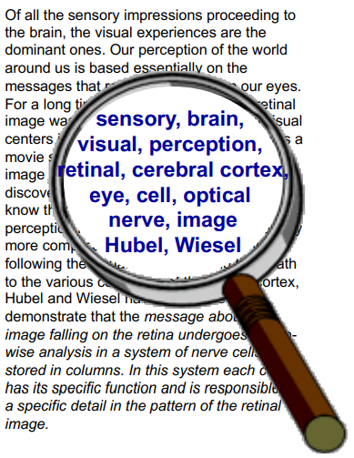
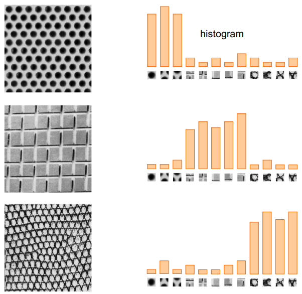
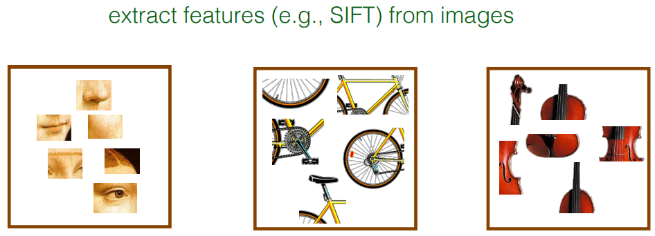
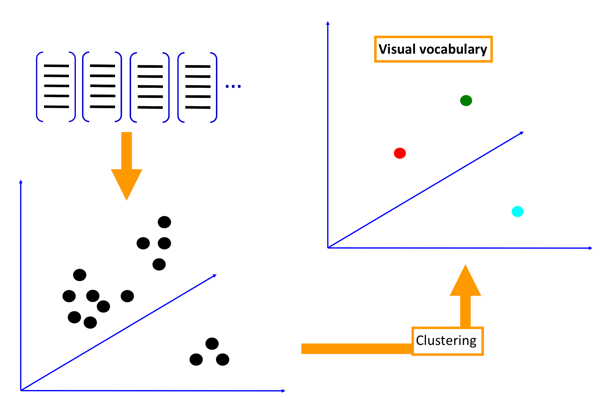
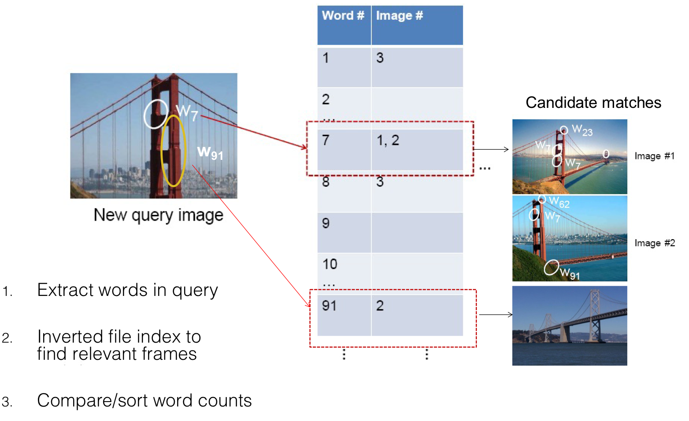
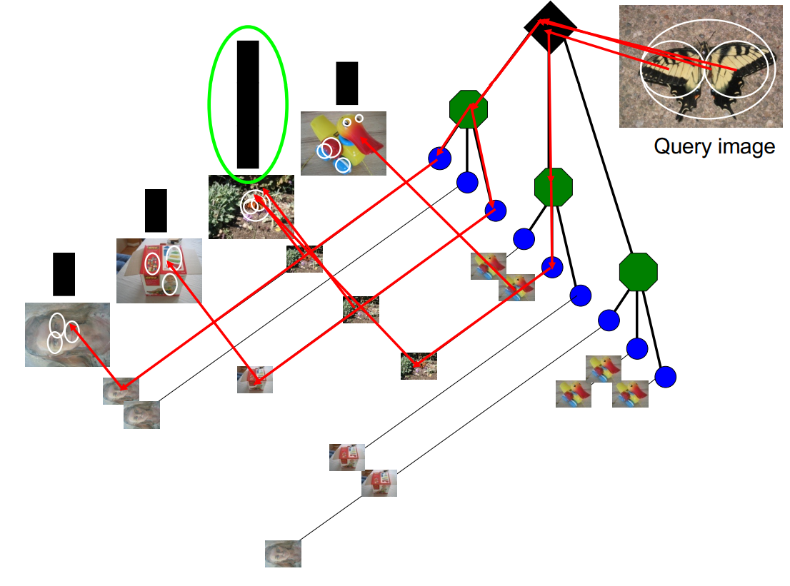

---
tags:
- CV
date: 19/10/2022
---

# Object Recognition

Object Recognition is a big family of computer vision algorithms. [Computer Vision Tasks](Computer%20Vision%20Tasks.md) gives an answer to what it means. The term is actually quite ambiguous

## History of ideas in recognition 
- 1960s – early 1990s: the geometric era 
- 1990s: appearance-based models 
- Mid-1990s: sliding window approaches 
	- Turk and Pentland, 1991
	- Belhumeur, Hespanha, & Kriegman, 1997
	- Schneiderman & Kanade 2004
	- Viola and Jones, 2000   
	- Schneiderman & Kanade, 2004
	- Argawal and Roth, 2002
	- Poggio et al. 1993   
- Late 1990s: local features 
- Early 2000s: parts-and-shape models   
	- Object as a set of parts
	- Relative locations between parts
	- Appearance of part
- Mid-2000s: bags of features 
- Present trends: Combined local and global methods, context, and deep learning

## Image Classification
Assume given a set of discrete labels, classify images into the labels.
### Data-driven Approach
- Collect a database of images with labels
- Use ML to train an image classifier
- Evaluate the classifier on test images

### Bag of Features
The general idea is to represent a data item as a histogram over features.

| Image/Object                       | Bag of Word                   |
| ---------------------------------- | ----------------------------- |
|  |  |

A not so crazy assumption here is:
spatial information of local features can be ignored for object recognition (i.e., verification). 

**Examples**:
- Orderless Document representation: frequencies of words from a dictionary 
- Texture recognition:   

An image is a vector of counts over each feature

$$
\mathbf{v}_{d} = [n(w_{1}), n(w_{2}), \dots, n(w_{T})]
$$

where $n(\cdot)$ counts the number of occurrences, $d$ is the index of the image, $T$ is the number of features and $w_{i}$ is the word . $\mathbf{v}_{d}$ is essentially a histogram over words.

**[tf–idf - Wikipedia](https://en.wikipedia.org/wiki/Tf%E2%80%93idf)(Term Frequency - Inverse Document Frequency)**

*Term frequency*

Suppose we have a set of English text documents and wish to rank them by which document is more relevant to the query, "the brown cow". A simple way to start out is by eliminating documents that do not contain all three words "the", "brown", and "cow", but this still leaves many documents. To further distinguish them, we might count the number of times each term occurs in each document; the number of times a term occurs in a document is called its _term frequency_. However, in the case where the length of documents varies greatly, adjustments are often made (see definition below). The first form of term weighting is due to [Hans Peter Luhn](https://en.wikipedia.org/wiki/Hans_Peter_Luhn "Hans Peter Luhn") (1957) which may be summarized as:

> The weight of a term that occurs in a document is simply proportional to the term frequency.

*Inverse document frequency*

Because the term "the" is so common, term frequency will tend to incorrectly emphasize documents which happen to use the word "the" more frequently, without giving enough weight to the more meaningful terms "brown" and "cow". The term "the" is not a good keyword to distinguish relevant and non-relevant documents and terms, unlike the less-common words "brown" and "cow". Hence, an _inverse document frequency_ factor is incorporated which diminishes the weight of terms that occur very frequently in the document set and increases the weight of terms that occur rarely.

[Karen Spärck Jones](https://en.wikipedia.org/wiki/Karen_Sp%C3%A4rck_Jones "Karen Spärck Jones") (1972) conceived a statistical interpretation of term-specificity called Inverse Document Frequency (idf), which became a cornerstone of term weighting:

> The specificity of a term can be quantified as an inverse function of the number of documents in which it occurs.

Not all words are created equal, weight each word by a heuristic

$$
\mathbf{v}_{d} = [n(w_{1})\alpha_{1}, n(w_{2})\alpha_{2}, \dots, n(w_{T})\alpha_{T}]
$$

where 

$$
\alpha_{i} = \log \left( \frac{D}{\sum_{d'}\mathbb{1}\{ w_{i}\in d' \}}  \right)
$$

is the inverse document frequency, and $D$ is the total number of images. 

#### Standard Pipeline
1. **Feature extraction**
	Extract features from images
	- Regular grid   
	- Interest point detector   
	- Other methods   
		- Random sampling (Vidal-Naquet & Ullman, 2002)
		- Segmentation-based patches (Barnard et al. 2003)

Note that the features are not image patches. 

2. **Dictionary learning**
Learn visual vocabulary using clustering

> **K-means clustering**
> Given $k$
> 1. Select initial $k$ centroids at random
> 2. Assign each object to the cluster with the nearest centroid
> 3. Computer each centroid as the mean of the objects assigned to it
> 4. Repeat previous 2 steps until no change
> 

3. **Encode**
Build bags-of-words(BOW) vectors for each image
- Quantization: ==image features gets associated to a visual word(nearest cluster center)== 
- Histogram: count the number of visual word occurrences 

4. **Classify**
Train and test data using BOWs

**Pros**:
- flexible to geometry / deformations / viewpoint
- compact summary of image content
- provides fixed dimensional vector representation for sets
- very good results in practice

**Cons**:
- background and foreground mixed when bag covers whole image
- optimal vocabulary formation remains unclear
- basic model ignores geometry

## Specific Object Recognition
Given an image region, we want to quickly find images in a large database that match the given image region.

### Fast Lookup: Inverted Index
Find all images in which a feature occurs

*Query inverted index*:
1. Extract words in query
2. Inverted file index to find relevant frames
3. Compare/sort word counts

The method requires sparsity. If most images contain most words, then we are not better off than exhaustive search.

### Vocabulary Tree
1. Build vocabulary tree recursively
2. Each leaf has inverted index
3. Build inverted index
4. Match

**Score the Result**

|  | Precision                               | Recall                                                                         |
| ----------------------------------- | --------------------------------------- | ------------------------------------------------------------------------------ |
| Figure                              |      |                                             |
| Formula                             | $$\text{Precision} = \frac{tp}{tp+fp}$$ | $$\text{Recall} = \frac{tp}{tp+fn} = \frac{\text{relevant}}{\text{returned}}$$ |

- True positive ($tp$)  -> correct attribution 
- True negative ($tn$) -> correct rejection
- False positive ($fp$) -> incorrect attribution
- False negative ($fn$) -> incorrect rejection

## Object Category Detection

1.  **Specify Object Model**
We need an object model to describe the object.
- Statistical template in bounding box
- Articulated parts model
- Hybrid template/parts model
- Deformable 3D model

2. **Generate Hypotheses/Proposals**
Propose an alignment of the model to the image.
- 2D template model/ sliding window
Test patch at each location and scale, each window is separately classified
- Voting from patches/keypoints
- Region-based proposal

3. **Score Hypotheses**
Mainly gradient-based features, many classifiers.

4. **Resolve Detections**
Rescore each proposed object based on context information.

- Non-maximum Suppression
Typical Object detection pipeline has one [component](https://towardsdatascience.com/region-proposal-network-a-detailed-view-1305c7875853) for generating proposals for classification. Proposals are nothing but the candidate regions for the object of interest. Most of the approaches employ a sliding window over the feature map and assigns foreground/background scores depending on the features computed in that window. The neighborhood windows have similar scores to some extent and are considered as candidate regions. This leads to hundreds of proposals. As the proposal generation method should have high recall, we keep loose constraints in this stage. However processing these many proposals all through the classification network is cumbersome. This leads to a technique which filters the proposals based on some criteria ( which we will see soon) called Non-maximum Suppression.

**Input:** A list of Proposal boxes B, corresponding confidence scores S and overlap threshold N.

**Output:** A list of filtered proposals D.

> **Algorithm:**
> 1.  Select the proposal with highest confidence score, remove it from B and add it to the final proposal list D. (Initially D is empty).
> 2.  Now compare this proposal with all the proposals — calculate the IOU (Intersection over Union) of this proposal with every other proposal. If the IOU is greater than the threshold N, remove that proposal from B.
> 3.  Again take the proposal with the highest confidence from the remaining proposals in B and remove it from B and add it to D.
> 4.  Once again calculate the IOU of this proposal with all the proposals in B and eliminate the boxes which have high IOU than threshold.
> 5.  This process is repeated until there are no more proposals left in B. 
> 
> IOU calculation is actually used to measure the overlap between two proposals. 

- Context/reasoning
	- Via geometry
	- Via known information or prior distributions
