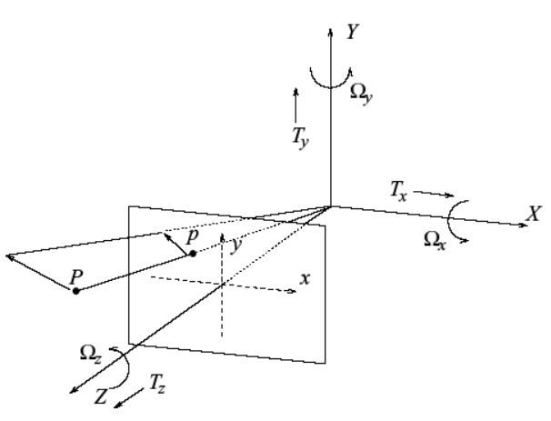
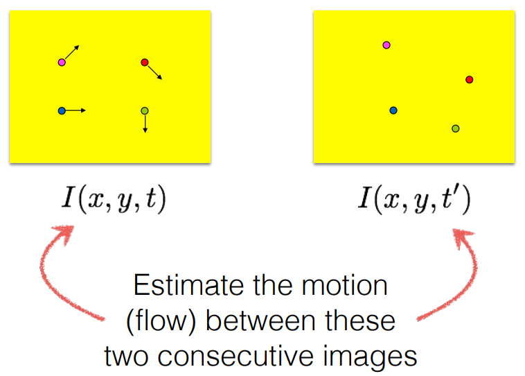
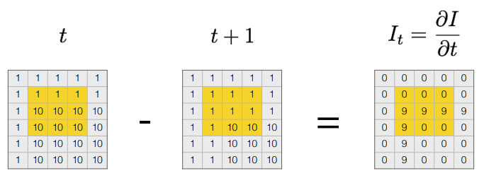
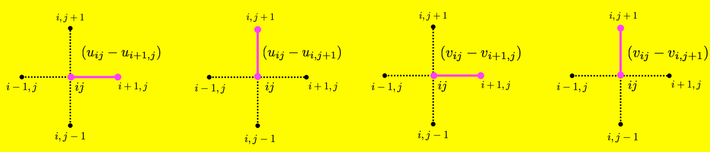

---
tags:
- CV
date: 05/10/2022
---

# Optical Flow


**Optical Flow**
2D velocity field describing the apparent motion in the images

## Problem Setting

### Background

Given two consecutive image frames, estimate the motion of each pixel

**Key assumptions**:
- Color constancy (brightness constancy): brightness of the point will remain the same 
$$
I(x(t),y(t),t) = \underset{ \text{const} }{ C }
$$
Allows for **pixel to pixel comparison** (not features)

- Small motion: pixels only move a little bit 
	- Optical flow(velocities): $(u,v)$
	- Displacement: $(\delta x, \delta y) = (u\delta t, v\delta t)$

### Brightness Constancy Equation
For a really small space-time step, ==corresponding pixels have the same intensity==

$$
I(x+u\delta t,y+v\delta t, t+\delta t) = I(x,y,t)
$$

Using the assumptions above we get the **Brightness Constancy Equation**

$$
\frac{ \partial I }{ \partial x } \frac{ dx }{ dt } +\frac{ \partial I }{ \partial y } \frac{ dy }{ dt } +\frac{ \partial I }{ \partial t }  = 0
$$

>**Proof**:
>Taylor expansion
>$$\begin{align} I(x + \delta x, y + \delta y, t+\delta t )  & = I(x,y,t)+ \frac{ \partial I }{ \partial x } \delta t+\frac{ \partial I }{ \partial y } \delta y+\frac{ \partial I }{ \partial t } \delta t  \\ & = I(x,y,t) \\ \implies \frac{ \partial I }{ \partial x } \delta t+\frac{ \partial I }{ \partial y } \delta y+\frac{ \partial I }{ \partial t } \delta t & =0 \quad \text{divide by } \delta t \\ \implies \frac{ \partial I }{ \partial x } \frac{ dx }{ dt } +\frac{ \partial I }{ \partial y } \frac{ dy }{ dt } +\frac{ \partial I }{ \partial t }   & = 0 \end{align}$$
> Equivalently written as
> $$I_{x}u+I_{y}v+I_{t} = 0$$
> and the vector form is 
> $$\nabla I^{\top} \mathbf{v} + I_{t} = 0$$

|             | Spatial Derivative                                                          | Optical Flow                                                                      | Temporal Derivative                         |
| ----------- | --------------------------------------------------------------------------- | --------------------------------------------------------------------------------- | ------------------------------------------- |
| Formula        | $I_x=\frac{\partial I}{\partial x} \quad I_y=\frac{\partial I}{\partial y}$ | $u = \frac{ dx }{ dt } \quad v = \frac{ dy }{ dt }$                               | $I_{t} = \frac{ \partial I }{ \partial t }$ |
| Calculation | Sobel filter, Derivative-of-Gaussian filter                                 | $(u,v)$ solution lies on a line, cannot be found uniquely with a single constrain | Frame differencing                          |

We already know how to compute the gradients. The temporal derivative is calculated by frame differencing: 


Apparently this equation 

$$I_{x}u+I_{y}v+I_{t} = 0$$

does not have a unique solution. We need more constraints to solve $(u,v)$.

### Small Aperture Problem
When the image patch contains only a line, we could not perceive the motion.
```image-layout-a


```

But patches with different gradients could avoid aperture problem

```image-layout-a


```

## Lucas-Kanade Optical Flow
### Characterization
- **Constant** flow: flow is constant for all pixels
- **Local** method: sparse system

### Assumptions
- Flow is locally smooth
- Neighboring pixels ==have the same displacement==

### Method
Consider a $5\times 5$ image patch, which gives us $25$ equations

$$
\begin{aligned}
I_x\left(\mathbf{p}_1\right) u+I_y\left(\mathbf{p}_1\right) v &=-I_t\left(\mathbf{p}_1\right) \\
I_x\left(\mathbf{p}_2\right) u+I_y\left(\mathbf{p}_2\right) v &=-I_t\left(\mathbf{p}_2\right) \\
\vdots & \\
I_x\left(\mathbf{p}_{25}\right) u+I_y\left(\mathbf{p}_{25}\right) v &=-I_t\left(\mathbf{p}_{25}\right)
\end{aligned}
$$


which is equivalent to

$$
A^{\top}A\mathbf{x} = - A^{\top}\mathbf{b}
$$

where 

$$
A = 
\begin{pmatrix}
I_{x}(\mathbf{p}_{1}) & I_{y}(\mathbf{p}_{1}) \\
I_{x}(\mathbf{p}_{2}) & I_{y}(\mathbf{p}_{2}) \\
\vdots & \vdots \\
I_{x}(\mathbf{p}_{25}) & I_{y}(\mathbf{p}_{25})
\end{pmatrix}
$$


and the solution writes

$$
\mathbf{x} = (A^{\top}A)^{-1}A^{\top}\mathbf{b}
$$

==The factor $A^{\top}A$ is exactly the Harris corner detector==

$$
A^{\top} A=\left[\begin{array}{ll}
\sum_{p \in P} I_x I_x & \sum_{p \in P} I_x I_y \\
\sum_{p \in P} I_y I_x & \sum_{p \in P} I_y I_y
\end{array}\right]
$$

and the r.h.s. equals

$$
-
\begin{bmatrix}
\sum I_{x}I_{t} \\
\sum I_{y}I_{t}
\end{bmatrix}
$$


$\implies$ Implications:
- Corners are when $\lambda_{1},\lambda_{2}$ are big; this is also when Lucas-Kanade optical flow works best
- Corners are regions with two different directions of gradient
- ==Corners are good places to computer flow==

## Horn-Schunck Optical Flow
### Characterization
- **Smooth** flow: flow can vary from pixel to pixel
- **Global** method: dense system

### Idea:
1. Enforce brightness constancy
	For every pixel

$$
\underset{ u,v }{ \min } \sum_{i,j} [I_{x}u_{ij}+I_{y}v_{ij}+I_{t}]^{2}
$$

2. Enforce smooth flow field
	Consider the following penalty function to enforce smoothness

$$
\underset{ \mathbf{u} }{ \min } \sum_{i,j}(\mathbf{u}_{i,j} - \mathbf{u}_{i+1, j})^{2}
$$

|  |  |
| ---------------------------- | ---------------------------- |
| Big penalty                  | Small penalty                |


### Method
Imagine that we are in a continuous scalar filed $I$ and vector filed $\mathbf{u}=(u,v)$, we want to minimize 

$$
E(u,v) = \underbrace{ E_{s}(u,v) }_{ \text{smoothness} } + \overbrace{ \lambda }^{ \text{weight} } \underbrace{ E_{d}(u,v) }_{ \text{brightness constancy} }
$$

In continuous form

$$
\begin{align}
E(u,v)  & = \iint  \underbrace{ (I(x+u(x,y), y+v(x,y),t+1) - I(x,y,t))^{2} }_{ \text{quadratic penalty for brightness change} }  \\
 & + \lambda\underbrace{ (\|\nabla u(x,y)\|^{2}+\|\nabla v(x,y)\|^{2}) }_{ \text{quadratic penalty for flow change} } \,dxdy
\end{align}
$$


In discretized version, we have

$$
\underset{ u,v }{ \min } \sum_{i,j}\{ \underbrace{ E_{s}(i,j) }_{ \text{smoothness} } + \underbrace{ \lambda E_{d}(i,j) }_{ \text{brightness constancy} } \}
$$

where 

$$
\begin{align}
E_{d}(i,j)  & = [I_{x}u_{ij}+I_{y}v_{ij} + I_{t}]^{2} \\
E_{s}(i,j)  & = \frac{1}{4}[(\mathbf{u}_{i+1,j} - \mathbf{u}_{i,j})^{2} + (\mathbf{u}_{i,j+1}-\mathbf{u}_{i,j})^{2}] \\
  & = \frac{1}{4}[(u_{i,j}-u_{i+1,j})^{2}+(u_{i,j}-u_{i,j+1})^{2} + (v_{i,j}-v_{i+1,j})^{2} + (v_{i,j}-u_{i,j+1})^{2}]
\end{align}
$$



To solve the minimization problem, we take the derivatives w.r.t $u_{kl}$ and $v_{kl}$

$$
\begin{aligned}
\frac{\partial E}{\partial u_{k l}} &=2\left(u_{k l}-\bar{u}_{k l}\right)+2 \lambda\left(I_x u_{k l}+I_y v_{k l}+I_t\right) I_x \\
\frac{\partial E}{\partial v_{k l}} &=2\left(v_{k l}-\bar{v}_{k l}\right)+2 \lambda\left(I_x u_{k l}+I_y v_{k l}+I_t\right) I_y
\end{aligned}
$$

where $\overline{u}_{kl} = \frac{1}{4}(u_{i+1,j}+u_{i,j+1} + u_{i-1,j} + u_{i,j-1})$ and $\overline{v}_{kl} = \frac{1}{4}(v_{i+1,j}+v_{i,j+1}+v_{i-1,j}+v_{i,j-1})$.

Set these two equations to zero, we have 

$$
\begin{aligned}
&\left(1+\lambda I_x^2\right) u_{k l}+\lambda I_x I_y v_{k l}=\bar{u}_{k l}-\lambda I_x I_t \\
&\lambda I_x I_y u_{k l}+\left(1+\lambda I_y^2\right) v_{k l}=\bar{v}_{k l}-\lambda I_y I_t
\end{aligned}
$$

Rearrange the equations to get 

$$
\begin{aligned}
&\left\{1+\lambda\left(I_x^2+I_y^2\right)\right\} u_{k l}=\left(1+\lambda I_x^2\right) \bar{u}_{k l}-\lambda I_x I_y \bar{v}_{k l}-\lambda I_x I_t \\
&\left\{1+\lambda\left(I_x^2+I_y^2\right)\right\} v_{k l}=\left(1+\lambda I_y^2\right) \bar{v}_{k l}-\lambda I_x I_y \bar{u}_{k l}-\lambda I_y I_t
\end{aligned}
$$

which turns the problem into a recursion problem: while not converged, we update $(u_{kl},v_{kl})$ as 

$$
\begin{aligned}
&\hat{u}_{k l}=\bar{u}_{k l}-\frac{I_x \bar{u}_{k l}+I_y \bar{v}_{k l}+I_t}{\lambda^{-1}+I_x^2+I_y^2} I_x \\
&\hat{v}_{k l}=\bar{v}_{k l}-\frac{I_x \bar{u}_{k l}+I_y \bar{v}_{k l}+I_t}{\lambda^{-1}+I_x^2+I_y^2} I_y
\end{aligned}
$$
